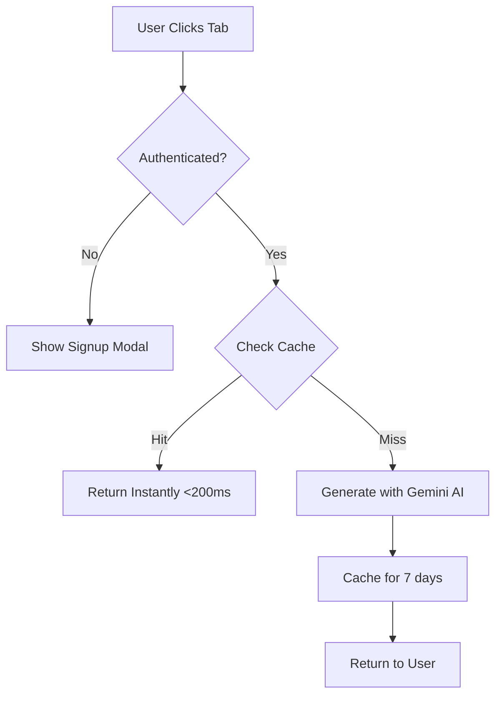

# 📋 Content Mode Tabs Feature Specification

:::info Status
**Ready for Team Review** ✅
**Branch**: `001-content-mode-tabs`
**Author**: Irfan (Junior Developer)
**Created**: 2025-11-17
:::

---

## 🎯 What We're Building

Add **3 toggleable content modes** to every lesson page:

```
┌─────────────────────────────────────────┐
│  Lesson: Introduction to Python        │
│  ─────────────────────────────────────  │
│  [Original] [Summary] [Personalized]    │  ← NEW TABS
│  ─────────────────────────────────────  │
│  Content appears here...                │
└─────────────────────────────────────────┘
```

### 1. **Original** (Default, No Login)
- Full lesson content (what exists today)
- Always accessible to everyone

### 2. **Summary** (Requires Free Signup)
- AI-condensed version (30-50% of original length)
- For quick review and revision
- **Example**: 15-minute lesson → 5-minute summary

### 3. **Personalized** (Requires Free Signup + Profile)
- AI-adapted to user's professional background
- **Accountant** → Finance analogies ("variables are like ledger accounts")
- **Doctor** → Medical analogies ("APIs are like patient referral systems")
- **Teacher** → Education analogies
- 8 professional contexts supported

---

## 💡 Why This Matters

### Business Value
- 📈 **40%+ engagement** increase expected
- 🌍 **Unlock non-technical audience** (accountants, doctors, teachers)
- 💰 **$&lt;50/month** operating costs
- 📊 **Data collection** (user preferences, behavior)
- 🚀 **Monetization foundation** (free signup → future premium)

### User Value
- ⚡ **Save time** (review lessons in 1/3 the time)
- 🎯 **Better comprehension** (content adapted to your background)
- 🔄 **Flexible learning** (learn vs review vs apply modes)

---

## 🏗️ Architecture Overview



### Tech Stack

**Existing Infrastructure** ✅:
- Frontend: React 19 + Docusaurus 3.9.2
- Backend: Vercel Serverless Functions
- AI: Google Gemini API

**New Components** 🆕:
- Database: Vercel Postgres (free tier: 256MB)
- Cache: Vercel KV / Redis (free tier: 256MB)
- Auth: JWT + bcrypt (production-grade)

---

## 💰 Cost Breakdown

### Free Tiers (Sufficient for MVP)
- ✅ Vercel Postgres: 256MB, 60 hours/month
- ✅ Vercel KV: 256MB, 100k commands/month
- ✅ Gemini API: 1500 requests/day
- ✅ Vercel Hosting: Included

### With 80% Caching Strategy
- **Week 1**: ~$8.50
- **Month 1**: ~$35
- **Target**: $&lt;50/month for 1000 active users ✅

---

## ⏱️ Implementation Timeline

### **Week 1: Authentication Foundation**
- Setup Vercel Postgres
- Build signup/login API
- Create AuthModal component
- Security audit

**Deliverable**: Users can signup → login → receive JWT

---

### **Week 2: Summary Mode**
- Build content generation API
- Setup Vercel KV caching
- Create ContentModeTabs component
- AI prompt engineering

**Deliverable**: Summary tab generates AI-condensed content in &lt;8 seconds

---

### **Week 3: Personalization**
- Add Personalized mode to API
- Create 8 professional context prompts
- Add 3rd tab to UI
- User profile page

**Deliverable**: Accountants see finance analogies, doctors see medical analogies

---

### **Week 4: Polish & Launch**
- Mobile responsive design
- Monitoring (Sentry, PostHog)
- Security review
- Documentation
- Soft launch → Full launch

**Deliverable**: Production-ready with &lt;1% error rate

---

## 📊 Success Metrics (3 Months)

| Metric | Target | Validates |
|--------|--------|-----------|
| Signups | 500+ | Feature demand |
| Tab Usage | 40%+ | User engagement |
| Satisfaction | 4.0/5.0 | Content quality |
| Cache Hit Rate | 80%+ | Cost efficiency |
| API Costs | Under $50/mo | Sustainability |
| Non-Technical Users | 40%+ | Personalization value |

---

## 🔒 Security Highlights

✅ **Production-Grade**:
- Passwords: bcrypt hashing (cost factor 12)
- Tokens: JWT in httpOnly cookies (XSS protection)
- API: Rate limiting (10 req/min per user)
- Input: SQL injection + XSS prevention
- HTTPS: Enforced (Vercel automatic)

✅ **Compliance**:
- GDPR-compliant (users can delete accounts)
- Audit logs for all auth events
- No PII in cache keys or logs

---

## 📚 Documentation Structure

This specification includes 5 comprehensive documents:

1. **Overview** (this page) - Quick introduction
2. **[Executive Summary](./summary)** - 5-minute business overview
3. **[Visual Guide](./visual-guide)** - UI mockups & architecture diagrams
4. **[Complete Specification](./spec)** - 864-line technical spec
5. **[Team Review Checklist](./checklist)** - Meeting agenda

---

## 🤔 Open Questions

### Q1: Database Choice
- **Recommended**: Vercel Postgres (native integration)
- **Alternative**: Supabase (built-in auth, but external)

### Q2: Professional Backgrounds
- **Current**: 8 options (Developer, Business, Accountant, Healthcare, Teacher, Designer, Legal, Other)
- **Question**: Add Marketing, Sales, Student?

### Q3: Cache Invalidation
- **Recommended**: Version-based cache keys (automatic)
- **Alternatives**: Manual API endpoint or TTL-only

### Q4: Freemium Architecture
- **Current**: All FREE after signup
- **Question**: Add `subscription_tier` field now?

---

## ✅ Review Checklist

Before approving this spec:

**Business**:
- [ ] Problem statement is clear
- [ ] Success metrics are realistic
- [ ] Cost projections are acceptable
- [ ] Timeline is achievable

**Technical**:
- [ ] Architecture is sound
- [ ] Security is production-ready
- [ ] Caching strategy is viable
- [ ] Scalability path exists

**UX**:
- [ ] UI mockups are intuitive
- [ ] Signup flow is frictionless
- [ ] Mobile responsive
- [ ] Edge cases covered

---

## 🚀 Next Steps

### After Approval:

1. Create ADRs (Architecture Decision Records)
2. Run `/sp.plan` (generate implementation plan)
3. Run `/sp.tasks` (break into actionable tasks)
4. Begin Phase 1: Authentication

---

:::tip Ready to Review?
Navigate to the other pages using the sidebar to explore:
- **Executive Summary** - Business case and high-level overview
- **Visual Guide** - UI mockups and system diagrams
- **Complete Spec** - Detailed technical specification
- **Review Checklist** - Meeting agenda and decision framework
:::

---

**This specification is ready for your 20+ developer team review!** 🎉
